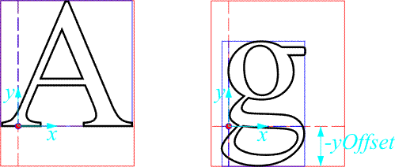

# U8g2 Font Format

Source: https://github.com/olikraus/u8g2/wiki/u8g2fontformat
 
- [U8g2 Font Format](https://github.com/olikraus/u8g2/wiki/#u8g2-font-format)
- [Font header](https://github.com/olikraus/u8g2/wiki/#font-header)
- [Glyph data](https://github.com/olikraus/u8g2/wiki/#glyph-data)
- [Glyph bitmaps](https://github.com/olikraus/u8g2/wiki/#glyph-bitmaps)
- [Pitches and distances](https://github.com/olikraus/u8g2/wiki/#pitches-and-distances)
- [Font Decoder](https://github.com/olikraus/u8g2/wiki/#font-decoder)

The data format of U8G2 fonts is based on the BDF font format. Its glyph bitmaps are compressed with a run-length-encoding algorithm and its header data are designed with variable bit field width to minimize flash memory footprint.


**Font Header**

| Offset (Byte) | Size  | Content |
|---:|:---|:---|
| 0. | 1 Byte | Number of glyphs |
| 1. | 1 Byte | Bounding Box Mode (not relevant for decoding) |
| 2. | 1 Byte | *m*0 Bit width of Zero-Bit run-length encoding in bitmap |
| 3. | 1 Byte | *m*1 Bit width of One-Bit run-length encoding in bitmap |
| 4. | 1 Byte | Bit width of glyph bitmap width (bitcntW) |
| 5. | 1 Byte | Bit width of glyph bitmap height (bitcntH) |
| 6. | 1 Byte | Bit width of glyph bitmap *x* offset (bitcntX) |
| 7. | 1 Byte | Bit width of glyph bitmap *y* offset (bitcntY) |
| 8. | 1 Byte | Bit width of glyph character pitch, delta to next glyph (bitcntD) |
| 9. | 1 Byte | Font Bounding Box width |
| 10. | 1 Byte | Font Bounding Box height |
| 11. | 1 Byte | Font Bounding Box *x* Offset |
| 12. | 1 Byte | Font Bounding Box *y* Offset |
| 13. | 1 Byte | Ascent (size above baseline) of letter "A" |
| 14. | 1 Byte | Descent (size below baseline) of letter "g" |
| 15. | 1 Byte | Ascent of "(" |
| 16. | 1 Byte | Descent of "(" |
| 17+18. | 2 Bytes | Array offset of glyph "A" |
| 19+20. | 2 Bytes | Array offset of glyph "a" |
| 21+22. | 2 Bytes | Array offset of glyph 0x0100 |

**Glyph (variable length)**

| Offset | Size | Content |
|:---|:---|:---|
| 0. | 1/2 Byte(s) | Unicode of character/glyph |
| 1. (+1) | 1 Byte | jump offset to next glyph |
|  | bitcntW | glyph bitmap width (variable width) |
|  | bitcntH | glyph bitmap height (variable width) |
|  | bitcntX | glyph bitmap *x* offset (variable width) |
|  | bitcntY | glyph bitmap *y* offset (variable width) |
|  | bitcntD | character pitch (variable width) |
|  | *n* Bytes | Bitmap (horizontal, RLE) |

## Font header

The font header (see table above) is always 23 Bytes long. It contains decoding parameters for the glyph bitmap data, font outline data, such as overall font bounding box dimensions, and index offsets for frequently used character ranges.

## Glyph data

The glyphs start immediately after the end of the initial data structure. All glyphs start with the unicode (1 byte) and the offset to the next glyph (1 byte). The offset is relative to the start of the glyph, e.g., if `data[off]` has the code point then `data[off+1]` has the offset to the next glyph, which is at `data[off+data[off+1]]`.

For the most important code range from 32...255 (decimal), array offsets of important glyphs ('A', 'a', and 0x100) are provided by the font header to minimize search overhead. The offsets are relative to the end of the font header.

The address for the unicode glyphs is the end of the initial data structure plus the 16 bit offset from bytes 21/22 of the initial data structure. All glyphs start with the unicode (2 bytes) and the offset to the next glyph (1 byte).

U8g2 version 2.23 introduces an additional jump table for quicker lookup of the unicode glyphs (issue #596). This jump table precedes the unicode glyph table. This means, the above calculated address points to the jump table. The jump table looks like this:

| offset (2 bytes) | unicode (2 bytes) |
| --- | --- |
| offset to the start of the glyph table | last unicode stored in the first block |
| size of the 1st block/offset to 2nd block | last unicode stored in the 2nd block |
| size of the 2nd block/offset to 3rd block | last unicode stored in the 3nd block |
| ... | ... |
| offset to the end of the gylph table | 0xffff |

This is the code to locate the start address of the glyph block. Inputs are:

- font: Start position of the lookup table
- encoding: The requested encoding.

The variable `font` will contain the start address of the glyphs.

```
unicode_lookup_table = font;   
    do
    {
      font += u8g2_font_get_word(unicode_lookup_table, 0);
      e = u8g2_font_get_word(unicode_lookup_table, 2);
      unicode_lookup_table+=4;
    } while( e < encoding );
```

For finding the corresponding glyph to a Unicode, the glyph array is jumped through, until the correct Unicode is either found or excessed.

All following glyph data does not rely on byte boundaries, but their bit widths are provided by the font header (See "Bit width of XX"). Since only relevant bit width for each property is stored instead of full bytes, we have reasonable reduction of stored data without much decoding overhead.

## Glyph bitmaps


Glyph bitmaps are 1-Bit horizontally packed bitmaps with tight fit bounding box (see image above). They are compressed by an ad-hoc run length algorithm. The bit array has

- *m <sub>0</sub>* Bits (see font header) denoting the number of zeros
- *m <sub>1</sub>* Bits (see font header) denoting the number of ones
- *n* Bits == 1 (to be counted) denoting the number of repetitions of the sequence and
- *1* Bit == 0 as stop marker for each sequence.

Run lengths go beyond lines. Glyph bitmaps don't contain end markers, since their widths and heights are known.

### Bounding boxes



In contrast to some other GFX systems, the co-ordinates of the bounding boxes point to the right and upwards. For the most characters, *x* -offset is the horizontal distance between the very left pixel of the glyph and the left border, so in the picture above, the *x* -offset is quite exaggerated. *y* -offset is the vertical distance between baseline and the lowest pixel. For most glyphs without descender, it is equal to zero, for glyphs with descender, it is negative.

Generally, the font bounding box is the outline of all glyph bounding boxes, with all offsets taken into account. Due to some large glyphs (e.g. for '@' and '|'), the font bounding box can be quite large - larger than typical character pitch or line height.

There are some fonts, where the font bounding box is a bit larger than the outline of all contained glyphs. This happens, when glyphs are removed. However, this makes no difference in font decoding or display.

Fonts can be generated in different bounding box modes:

- \[t=1\]: Transparent mode. All glyph bounding boxes are tight fit. This generates minimal flash memory footprint.
- \[h=2\]: Height mode. All glyph bounding boxes are horizontally tight fit, but have the same height. This allows overwriting text lines without clearing.
- \[m=3\]: Monospaced mode. All glyph bounding boxes have the same size, which is equal to font bounding box size.

Bounding box mode is the second last character of the font name (see [font names](https://github.com/olikraus/u8g2/wiki/fntlistall#u8g2-font-names)).

### Line pitch

For tabular data, the height of the font bounding box is a valid choice for the line pitch. For plain text, Ascents and descent of 'A', 'g' and '(', which are provided by the font header, can serve as base for typographically correct line pitch.

Horizontal pitch after each glyph is provided by the glyph header data.

No preparations for kerning have been taken. Advanced kerning could be implemented either manually by counting white space between glyphs in display memory and for calculating of kerning correction, or using kerning information, which is available for some BDF fonts, but exported in a separate file. However, one should avoid kerning on LCD screens for better readability.

For calculation of line breaks, the width and x-offset of the glyph bounding box are suitable.

## Font Decoder

Glyph data (glyph header data as well as glyph bitmap) is stored in bit arrays independent of byte boundaries to minimize flash memory footprint (see section [Glyph Data](https://github.com/olikraus/u8g2/wiki/u8g2fontformat#glyph-data) ). Each data can be accessed independently and stateless, since all offsets are provided by the font header. However, the decoder functions are designed to decode all glyph data in fixed sequence to increase efficiency.

A state variable of type u8g2\_font\_decode\_t contains decoder state as well as decoded glyph header data. The functions u8g2\_font\_decode\_get\_unsigned\_bits and u8g2\_font\_decode\_get\_signed\_bits fetch the byte-independent data, store it to standard fixed-width integer types and update the decoder state variable.
